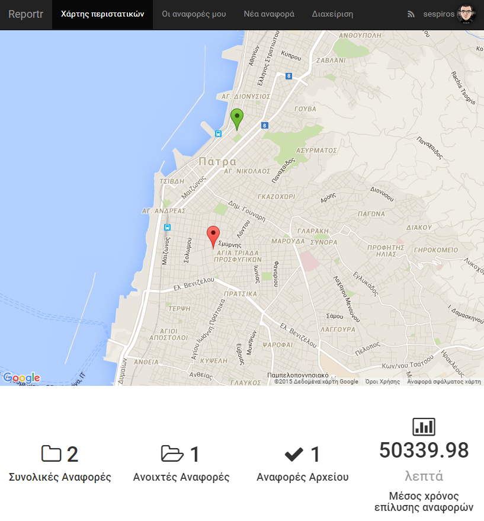
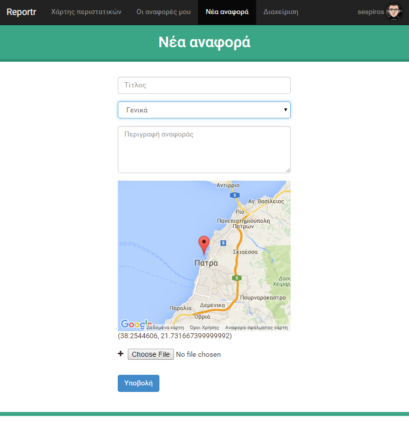
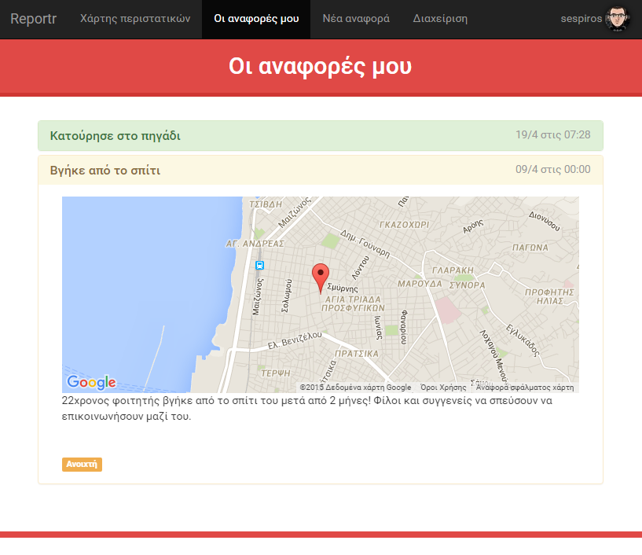
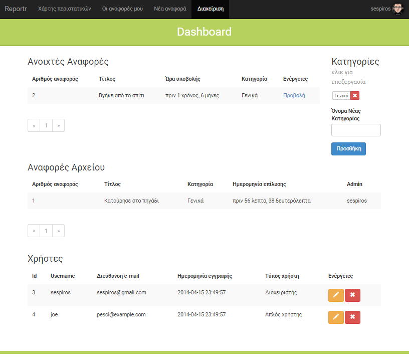

# Reportr
A location based, crowdsourcing reporting system written in PHP.

- Users can register and submit tickets based on their location.
- User-friendly map showing submitted tickets, resolved tickets and several other stats.

## Usage
- Set a database and a user in config/config.php
- Import sql/webproject.sql
- Use the script in testbench to stress test it :P
